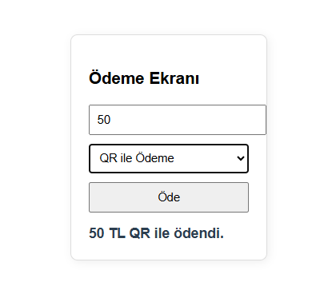
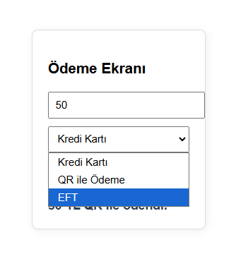

# 💳 Ödeme Yöntemi Entegrasyon Sistemi (SOLID & Strategy Pattern)

Bu proje, bir ödeme sistemine mevcut kod yapısını bozmadan yeni ödeme yöntemlerinin (QR, EFT, vb.) nasıl eklenebileceğini **SOLID** prensiplerini ve **Strategy Design Pattern**'ı kullanarak simüle eden bir Spring Boot uygulamasıdır.

## 🚀 Proje Hakkında
Uygulama, gerçek dünya senaryolarında karşılaşılan "mevcut sisteme yeni özellik ekleme" ihtiyacını, kodun sürdürülebilirliğini ve esnekliğini koruyarak çözmeyi amaçlar. Backend tarafı Java/Spring Boot ile kurgulanmış olup, basit bir HTML/JS arayüzü ile uçtan uca çalışmaktadır.

## 📸 Uygulama Ekran Görüntüleri
Sistemin çalışma anına dair arayüz ve başarılı işlem çıktıları aşağıdadır:





## 🛠 Teknik Gereksinimler & Teknolojiler
* **Dil:** Java 21
* **Framework:** Spring Boot 4.0.5
* **Tasarım Deseni:** Strategy Design Pattern
* **Frontend:** Vanilla JavaScript & HTML (Client-Side Rendering)

## 📌 Uygulanan SOLID Prensipleri

Proje geliştirilirken aşağıdaki yazılım prensipleri temel alınmıştır:

### 1. Single Responsibility Principle (SRP)
Her sınıfın tek bir görevi vardır. `PaymentController` sadece isteği alır, `PaymentService` stratejiyi seçer ve her `Strategy` sınıfı sadece kendi ödeme yöntemini bilir.

### 2. Open/Closed Principle (OCP)
Sistem, yeni ödeme yöntemleri eklemeye **açık**, ancak mevcut kodu değiştirmeye **kapalıdır**. Yeni bir yöntem eklemek için mevcut sınıflara dokunmadan sadece yeni bir strateji sınıfı eklemek yeterlidir.

### 3. Dependency Inversion Principle (DIP)
Üst seviye modüller (`PaymentService`), alt seviye modüllere (`CreditCardStrategy`) doğrudan bağımlı değildir. Her ikisi de soyut bir arayüze (`IPaymentStrategy`) bağımlıdır.

## 📂 Klasör Yapısı
```text
com.example.payment
├── constants       # PaymentType Enum (Tip güvenliği için)
├── controller      # REST API Endpoint tanımları
├── dto             # Veri taşıma objeleri (PaymentRequest)
├── service         # İş mantığı ve Strateji yönetimi
└── strategy        # Strateji arayüzü ve somut sınıflar
