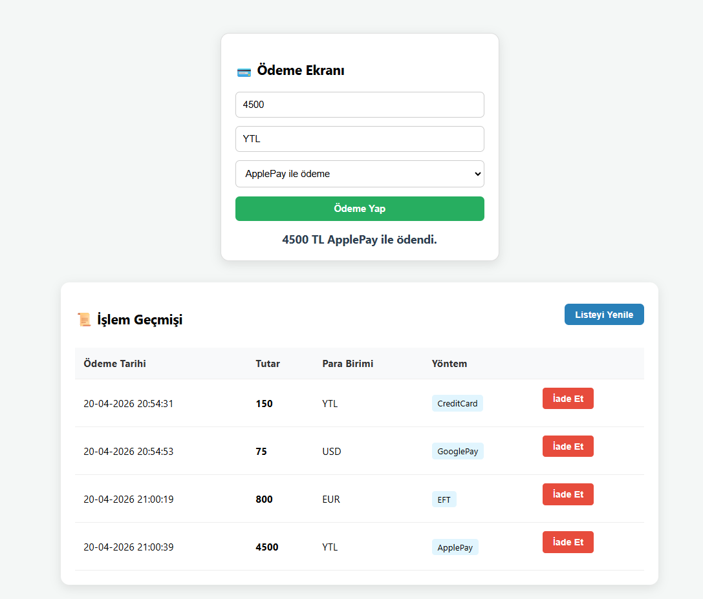

# Ödeme Yöntemi Entegrasyon Sistemi (SOLID)

Bu proje, bir ödeme sistemine mevcut kod yapısını bozmadan yeni ödeme yöntemlerinin (QR, EFT, vb.) nasıl eklenebileceğini **SOLID** prensiplerini ve **Strategy Design Pattern** ve **Factory Design Pattern** kullanarak simüle eden bir Spring Boot uygulamasıdır.

## Proje Hakkında
Uygulama, gerçek dünya senaryolarında karşılaşılan "mevcut sisteme yeni özellik ekleme" ihtiyacını, kodun sürdürülebilirliğini ve esnekliğini koruyarak çözmeyi amaçlar. Backend tarafı Java/Spring Boot ile kurgulanmış olup, basit bir HTML/JS arayüzü ile uçtan uca çalışmaktadır.

## Uygulama Ekran Görüntüsü
Sistemin çalışma anına dair arayüz işlem çıktıları aşağıdadır:




## Teknik Gereksinimler & Teknolojiler
* **Dil:** Java 17+
* **Framework:** Spring Boot 4.0.5 (Web MVC + Data JPA + Validation)
* **Database:** Postgresql 17.5
* **Konteynerleştirme:** Docker & Docker Compose
* **Tasarım Deseni:** Strategy Design Pattern, Factory Design Pattern
* **Frontend:** Vanilla JavaScript & HTML (Client-Side Rendering)

## Uygulanan SOLID Prensipleri

Proje geliştirilirken aşağıdaki yazılım prensipleri temel alınmıştır:

### 1. Single Responsibility Principle (SRP)
Her sınıfın tek bir görevi vardır. `PaymentController` sadece isteği alır, `PaymentService` stratejiyi seçer ve her `Strategy` sınıfı sadece kendi ödeme yöntemini bilir.

### 2. Open/Closed Principle (OCP)
Sistem, yeni ödeme yöntemleri eklemeye **açık**, ancak mevcut kodu değiştirmeye **kapalıdır**. Yeni bir yöntem eklemek için mevcut sınıflara dokunmadan sadece yeni bir strateji sınıfı eklemek yeterlidir.

### 3. Dependency Inversion Principle (DIP)
Üst seviye modüller (`PaymentService`), alt seviye modüllere (`CreditCardStrategy`) doğrudan bağımlı değildir. Her ikisi de soyut bir arayüze (`IPaymentStrategy`) bağımlıdır.

## 📂 Klasör Yapısı
```text
com.example.payment
├── controller
│   └── PaymentController.java          // API Endpoint'leri (POST, GET)
├── dto
│   ├── converter
│   │   └── PaymentDtoConverter.java    // Entity <-> DTO dönüşümü
│   ├── CreatePaymentRequest.java       // Kullanıcıdan gelen ödeme verisi
│   └── PaymentDto.java                 // Dışarıya dönülen ödeme verisi
├── exception
│   └── GlobalExceptionHandler.java     // Hata yakalama (Örn: 400 Bad Request)
├── model
│   └── Payment.java                    // PostgreSQL Tablosu (Entity)
├── repository
│   └── PaymentRepository.java          // JPA Repository (DB İşlemleri)
├── service
│   ├── PaymentFactory.java             // Doğru Stratejiyi Seçen Sınıf
│   └── PaymentService.java             // İş Mantığının Yönetildiği Yer
├── strategy
│   ├── ApplePayStrategy.java           // Apple Pay İşleme Mantığı
│   ├── CreditCardStrategy.java         // Kredi Kartı İşleme Mantığı
│   ├── EFTStrategy.java                // EFT/Havale İşleme Mantığı
│   ├── GooglePayStrategy.java          // Google Pay İşleme Mantığı
│   ├── IPaymentStrategy.java           // Strateji Arayüzü (Interface)
└── PaymentApplication.java             // Uygulamayı Başlatan Ana Sınıf

src/main/resources
├── static
│   └── index.html                      // Tarayıcıda Açılan Arayüz Dosyası
├── templates                           // (Opsiyonel) Sunucu Şablonları
└── application.properties              // PostgreSQL ve Port Ayarları
```

## Projenin Çalıştırılması


Proje kök dizininde docker-compose.yml ve Dockerfile dosyalarının olduğundan emin olun.


Terminalden şu komutu çalıştırarak her şeyi (Database + App) tek seferde ayağa kaldırabilirsiniz:

```text
docker-compose up --build
```

Bu komut veritabanını oluşturur, Maven ile projeyi derler ve uygulamayı yayına alır.

Uygulama ayağa kalktığında paymentsDB otomatik olarak oluşturulur.

Erişim: Uygulama ayağa kalktıktan sonra tarayıcıdan şu adrese gidiniz: http://localhost:8080/index.html